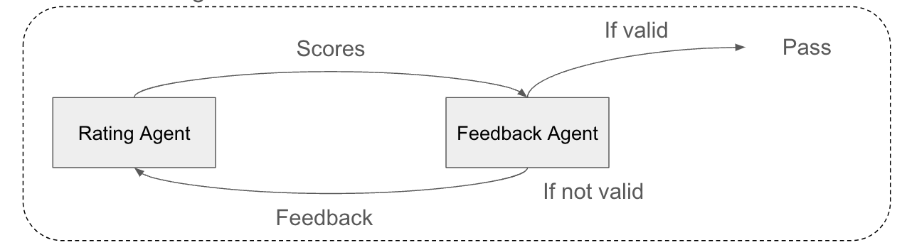

# Personal Shopper AI

## Overview
Personal Shopper AI is a service designed to assist customers in shopping by recommending and explaining various products. The AI scrapes product information, extracts keywords, and recommends personalized products based on the user's preferences and needs. 

## Features

### 1. Product Input and Keyword Extraction
- **User Input**: Users provide a description of the product they are looking for.
- **Keyword Extraction**: The AI extracts relevant keywords and attributes from the user's input to form a search query.

### 2. Web Scraping
- **Scraping Process**: The system scrapes multiple shopping sites (Naver, Coupang, G-Market, Kurly) to gather product data, including prices, reviews, and detailed descriptions.
- **Vision GPT** : Even if product details are given as images, personal shopper ai may read them and summarize important information.

    - Process
        1. **Local Image Download**: Download the image to the local system.
        2. **Image Size Check**: Ensure the image is not larger than 20MB as images over this size cannot be processed.
        3. **Image Encoding**: Convert the image to base64 format before sending it to the API.


### 3. Product Recommendation
- **Personalized Recommendations**: The AI provides tailored product suggestions based on the user's specific requirements (e.g., a professional cyclist vs. a parent looking for a child's bike).
- **Rating Agent**: Evaluates products based on several criteria such as price, review positivity, and specific product features.
- **Sorting and Comparison**: Sorts products by their overall score and provides the best option to the user.

### 4. Decision Making and Purchase Assistance
- **Shopping Aid**
  - **Purpose**: Assists in purchasing complex products (like baby utensils, speakers, keyboards) by considering relevant standards which should guide the choice.
  - **Advantage**: Utilizes the strength of GPT to extract the product name and the most frequently mentioned critical evaluation criteria, providing organized information to aid users in making informed decisions.

#### 4-a Filtering Agent

- **Function**: Filters out products that meet specific conditions requested by the user from all the products scraped.
- **Purpose**: Ensures that only products which match the user-defined criteria are considered, improving the relevance and efficiency of the product selection process.
- **Process**: The agent filters only suitable products by checking whether the product meets the user's criteria or whether there is a purchaseable option by referring to text information and vision gpt obtained from the product's detailed information page.

#### 4-b Rating Agent

- **Function**: Rates how well a product meets the decision criteria, assigning scores between 1 and 5.
- **Details**: This agent evaluates the product based on predefined criteria relevant to the product's category (e.g., material quality, user experience, functionality).
- **Problems** : It is not guaranteed that a valid score has been given. Due to the instability of gpt performance, sometimes unreasonable scores can be given.

#### 4-c. Feedback Agent

- **Role**: Reviews the scores given by the Rating Agent to ensure they are appropriate based on the detailed product review data.
- **Process**:
  - If the score is deemed valid, it is accepted.
  - If not, feedback is provided to reassess the score.


## Technical Details

### 1. Pipeline
The project is divided into several key components:
- **Keyword Agent**: Extracts and categorizes keywords from user input.
- **Web Scraper**: Gathers product information from various shopping websites.
- **Filtering Agent**: Exclude products that do not meet user standards.
- **Rating Agent**: Assesses products using predefined criteria.
- **Feedback Agent**: Reviews the rating process to ensure accuracy.

### 2. Fine-Tuning GPT
- **Training Data**: Custom datasets are used to fine-tune GPT models for specific tasks, ensuring accurate keyword extraction and product recommendations.
- **Experimentation**: Continuous testing and refining of the models to improve performance and reliability.

## Limits & Further Plans

### 1. Lack of Complementary Information

- **Issue**: The collected product information serves only a competitive role rather than a complementary one.
- **Implication**: This limits the ability to provide a holistic view of product benefits, especially when comparing features across different products.

### 2. Incomplete Keyword Logic

- **Initial Intention**: The original plan was to optimize search keywords specific to each shopping site.
- **Current State**: Due to time constraints, this intention could not be fully implemented, resulting in the use of generic search keywords applicable to all sites.
- **Plan**: Develop site-specific search and filtering keywords to enhance search precision and relevance.

### 3. Review Importance in Rating Agent

- **Challenge**: Due to GPT's maximum token limit, it's not feasible to include all product information for rating. The Rating Agent currently uses basic information and a few reviews.
- **Impact**: The quantity and quality of reviews significantly influence ratings, necessitating a sufficient number of reviews for accurate evaluation.
- **Consideration**: The sequence and selection of reviews (e.g., most helpful, newest, critical) need to be optimized to improve the rating accuracy.

### 4. User Preferences in Evaluation

- **Current Method**: Ratings are averaged based on fixed criteria (price, review positivity, and three evaluation factors).
- **Enhancement**: Allow users to assign weight to criteria according to their preferences. For example, if price is the most critical factor, it should have a higher impact on the overall rating.

### 5. User-Defined Evaluation Factors

- **Current Approach**: Evaluation factors are currently selected by the Rating Keyword Agent.
- **Future Improvement**: Enable users to specify their own evaluation factors. For instance, when purchasing a hand cream, users might input factors like 'moisturizing effect,' 'finish feel,' and 'ease of use.'


## How to Use

### Preparation Steps

For large websites like Coupang, Naver, etc., software-based access is often classified as a bot, making scraping tasks difficult. To prevent scraping tasks from being blocked, this project uses the Python Selenium library in debugging mode.

### Debugging Mode Setup

### For MAC Users Only
(Windows users should find their own way to run debugging mode)

```sh
/Applications/Google\ Chrome.app/Contents/MacOS/Google\ Chrome --remote-debugging-port=9222 --user-data-dir="/Users/{UserName}/Applications/Google Chrome.app/"
/Applications/Google\ Chrome.app/Contents/MacOS/Google\ Chrome --remote-debugging-port=9223 --user-data-dir="/Users/{UserName}/Applications/Google Chrome.app/"
/Applications/Google\ Chrome.app/Contents/MacOS/Google\ Chrome --remote-debugging-port=9224 --user-data-dir="/Users/{UserName}/Applications/Google Chrome.app/"
/Applications/Google\ Chrome.app/Contents/MacOS/Google\ Chrome --remote-debugging-port=9225 --user-data-dir="/Users/{UserName}/Applications/Google Chrome.app/"
```

Open the terminal and replace `{UserName}` with your username on your MAC, then execute the command. A browser window that can be controlled in debugging mode will open, and all future scraping tasks will be performed through this browser window.

### Multithreading

This project scrapes information from four sites (Coupang, Naver, Gmarket, Market Kurly). To speed up this process, the code is written based on multithreading. Therefore, you need to create 4 browser windows in debugging mode to execute multithreading.

### Setting config_template
```
#Coupang
Coupang_id = ""
Coupang_pw = ""

#Naver
naver_id = ""
naver_pw = ""

#Market Kurly
kurly_id = ""
kurly_pw = ""

#Gmarket
gmarket_id = ""
gmarket_pw = ""
```

To proceed with this project, you need to configure the config_template. For the purchase process, login information for Coupang, Naver, Gmarket, and Market Kurly is required. Please set the ID and password information for each site in this file.


### Running code
To run the application, execute the main.py script.

```
python main.py
```

Upon running the script, you will be prompted to enter a search keyword.
When you see the prompt asking for a "Search KeyWord 입력," enter the keyword for the product you are interested in. For example, you might enter:

```
Search KeyWord 입력:계곡에서 사용하기 좋은 물안경
```

When a search keyword is entered, the following processes are executed in sequence: keyword extraction, scraping, filtering, rating, and feedback.

```
ating keyword : price, review positivity, 성분, 피부 타입, 용량

1순위 : 5번 product , scores = [4, 5, 5, 5, 4.774], 평균 점수 : 4.75
2순위 : 2번 product , scores = [4, 5, 4, 5, 3.964], 평균 점수 : 4.39
3순위 : 1번 product , scores = [4, 4, 4, 5, 4.164], 평균 점수 : 4.23
4순위 : 10번 product , scores = [5, 4, 5, 3, 2.778], 평균 점수 : 3.96
최종 선택할 product의 번호를 입력하세요:
```

After all processes are completed, the top-rated sites are recommended. You can then enter the number of the desired site in the input field, and the purchase process will proceed on the selected site.

## Contributors
- **Kim Dongwoo**
- **Lee Chaewon**
- **Lim Saebom**

## Conclusion
Personal Shopper AI aims to revolutionize the online shopping experience by providing a smart, personalized, and efficient shopping assistant. The project leverages advanced AI techniques and continuous refinement to meet the dynamic needs of users.

